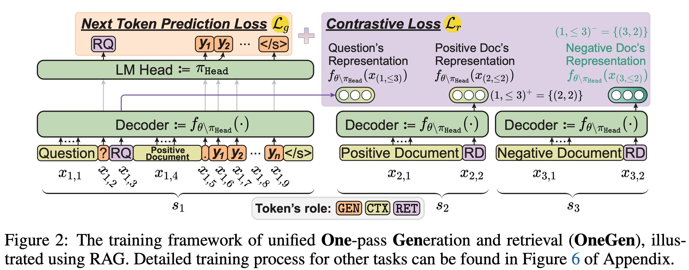
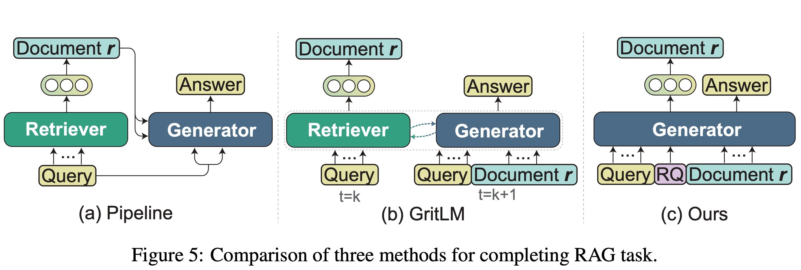

<div align="center">
<h1 align="center"> 👉 OneGen 👈 </h1>
<b>OneGen: Efficient One-Pass Unified Generation and Retrieval for LLMs</b>
  
<p align="center">
  <a href="https://arxiv.org/">📄arXiv</a> •
  <a href="https://x.com/">𝕏 Blog</a> •
  <a href="https://huggingface.co/">🤗 HF</a>
  <a href="https://drive.google.com">☁️ Google Drive</a>
</p>

[](https://github.com/zjunlp/OneGen) 
[](https://opensource.org/licenses/MIT)
 
</div>

## Table of Contents

- 📋[TODO](#todo)
- 👀[Overview](#overview)
- 🔧[Installation](#installation)
- 🏃[Quick Start](#quick-start)
- 🚩[Citation](#citation)


## 📋TODO

- [ ] Support LoRA train
- [ ] Refactor evaluation code
- [ ] Upload model
- [ ] Code documentation
- [ ] Support vLLM inference
- [ ] Support distributed embedding

## 👀Overview

We introduce a **One**-pass **Gen**eration and retrieval framework (**OneGen**) for fine-tuning LLMs on generation, retrieval, or hybrid tasks. Our core idea is to integrate generation and retrieval to the same context by allocating the retrieval task to *retirval tokens* generated in an autoregressive manner, thus enabling LLM to perform both tasks in a single forward pass.

The following figure illustrates the training process. We fisrt introduce the concept named `roles of tokens in LLMs`. A token $x_i$ is the basic unit processed by an LLM. Token in the input of an LLM serves three different roles:
- *Generating next token*, noted as $role(x_i)=\texttt{GEN}$.
- *Providing context information*, noted as $role(x_i)=\texttt{CTX}$.
- *Representing a sentence*, noted as $role(x_i)=\texttt{RET}$.

Hence, we apply the *cross-entropy loss* for the token $x_i$ where $role(x_i)=\texttt{GEN}$ and apply the *contrastive loss* for the token $x_i$ where $role(x_i)=\texttt{RET}$. This is the training overview.



The following figure illustrates the inference process of different methods for RAG task. First, we can see both GritLM and OneGen only need to deploy a single model, which can lower the deployment cost. However, GritLM achieves generation and retrieval within a single model by switching back and forth between causal attention and bidirectional attention. Additionally, both GritLM and the Pipeline method require explicit queries, which leads to the need for two forward passes for the queries. In contrast, OneGen can perform retrieval during the generation process, thus **avoiding the two forward pass calculations** for the queries and **allowing for the direct use of kv-cache**, significantly reducing inference costs.



## 🔧Installation

```bash
git clone https://github.com/zjunlp/OneGen
cd OneGen
conda create -n onegen python=3.9 -y
conda activate onegen
pip install -r requirements.txt
```

## 🏃Quick Start


```bash
# Entity Linking
deepspeed train.py --workflow workflow/entity_linking/llama2.json
# Single-Hop QA
deepspeed train.py --workflow workflow/self_rag/llama2.json
# Multi-hop QA
deepspeed train.py --workflow workflow/multi_hop_qa/llama2.json
```

```bash
bash eval_scripts/eval_self_rag.sh
```

```bash
bash eval_scripts/eval_multi_hop.sh
```

## 🚩Citation

If this work is helpful, please kindly cite as:

```bibtex

```

